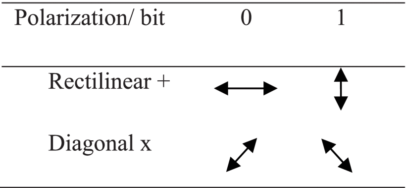
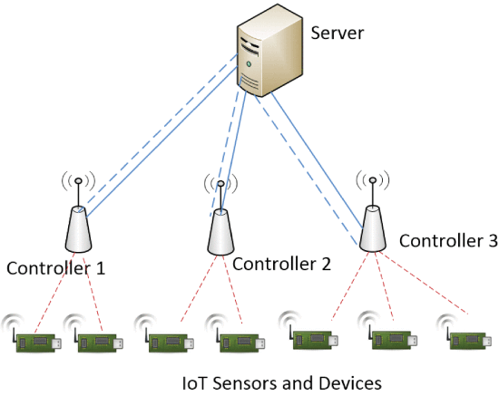
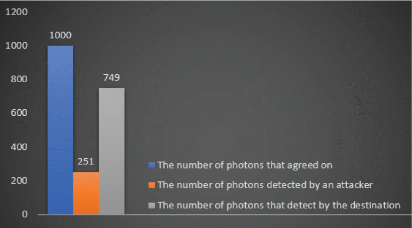
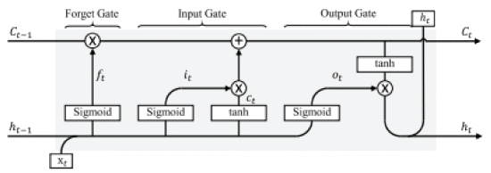
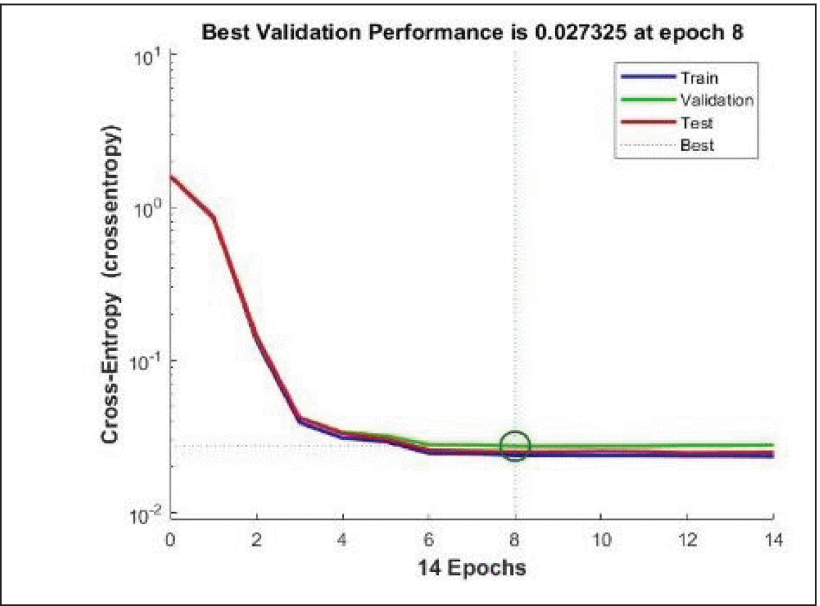
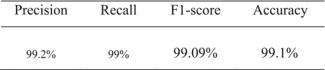
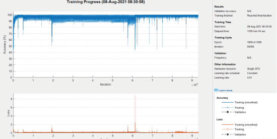

# Enfoque:

> Analizar los desafios de proteger los dispositivos IoT en la era cuantica.

> Usar redes neuronales artificales y aprendizaje profundo para detectar atacantes.

> Se propone un algoritmo para detectar un atacante entre un transmisor y un receptor,
    con el efecto secundario de interrumpir el proceso QKD mientras se detecta al atacante.

> Investigar QKD en redes mas alla de 5G.

> Describir un escenario de implementación para proteger las comunicaciones de IoT para sensores
    implementados en redes ferroviarias

> No interrumpir el proceso de distribución de claves.
<!-- end_slide -->

## Redes mas alla de 5G y 6G

### Motivo:

la potencia limitada y las capacidades computacionales de los
dispositivos de IoT los hacen vulnerables, especialmente con el potencial de sufrir ataques cuánticos.

### Solución propuesta:

Utilizar la distribución de claves cuánticas (QKD) entre los controladores (dispositivos potentes que administran grupos de sensores de IoT) y el servidor para generar claves de cifrado seguras. Luego, estas claves se distribuyen a los dispositivos individuales para cifrar sus datos antes de la transmisión.

### Metodo:

Investigar la seguridad del sistema QKD propuesto utilizando técnicas de aprendizaje automático (ANN y aprendizaje profundo) para detectar la presencia de atacantes con alta precisión.

<!-- end_slide -->

# Quantum Key Distribution
QKD involucra a tres partes: Alice (transmisora), Bob (receptora) y Eve (potencial atacante).

Dos canales de comunicacion:
- cuantico
- clasico

### Como funciona?

- Alice transmite fotones con cuatro polarizaciones posibles: 0°, 90°, 45° y 135°.
- Alice y Bob acuerdan un mapeo: cada estado de polarización corresponde a un valor de bit (0 o 1).
- Bob recibe fotones:
  1. Utiliza dos detectores: un filtro rectilíneo y un filtro diagonal.
  2. Cada filtro permite que polarizaciones específicas pasen sin cambios, pero modifica otras.

<!-- end_slide -->

### Como funciona?

- Bob no conoce el estado de polarización: elige aleatoriamente un filtro para cada fotón recibido.
- Intercambio de información a través del canal clásico:
     - Alice y Bob comparten información sobre los filtros elegidos por Bob.
     - Descartan partes donde Bob usó el filtro incorrecto.
- El desafío de Eva:
     - Intercepta los fotones para robar la clave.
     - Elige aleatoriamente filtros para intentar capturar los fotones.
     - Las intervenciones de Eva cambian la polarización de algunos fotones.
- Control de seguridad:
     - Alice y Bob comparan una parte de sus flujos clave.
     - Si la tasa de error supera un umbral, descartan la clave y repiten el proceso.

<!-- end_slide -->

# Modelo del sistema

Se debe minimizar el impacto en los sensores de IoT con limitación de energía y computación.

## Aprendizaje automático: implementado en el servidor, no en sensores.

## Distribución de claves:

- Servidor y controlador: utilizan QKD para intercambiar una clave para cada enlace controlador-sensor.
- Controlador y sensor: utilice técnicas tradicionales de distribución de claves a través de un canal inalámbrico.

<!-- end_slide -->

### Se puede detectar atacantes sin ML?
<!-- column_layout: [2, 1] -->

<!-- column: 0 -->
Método de detección consiste en utilizar un algoritmo que formalice los procesos de deteccion.
- Complejidad: O(N), donde N es el número de fotones transmitidos.
- N = 1000 fotones transmitidos.
- Atacante detectado debido a una diferencia significativa entre:
- Fotones acordados (N)
- Fotones detectados correctamente
- Fotones que llegan al destino sin modificación.

<!-- column: 1 -->

Resultados:

<!-- reset_layout -->

Sin embargo este metodo tiene sus limitaciones, como interrumpir la comunicacion QKD y
no puede prevenir el ataque, solo lo detecta.
<!-- end_slide -->

## Redes neuronales artificiales y técnicas de aprendizaje profundo para detectar atacantes

Beneficios del aprendizaje automático:
- Basado en datos: aprende de los datos sin suposiciones previas.
- Generalizable: puede funcionar bien con datos invisibles.
- Maneja relaciones no lineales: eficaz para problemas complejos.

Limitaciones:
- Requiere una cantidad significativa de datos de entrenamiento.
- Puede resultar computacionalmente costoso.
- Elegir la arquitectura del modelo adecuado es crucial.

En general, las redes neuronales poco profundas y los LSTM,
se pueden utilizar para detectar atacantes en el proceso QKD con resultados prometedores.
<!-- end_slide -->

# Resultados

Pero, hay en realidad discusión sobre si usar redes neuronales artificiales
o memoria a corto plazo para detectar atacantes?

<!-- column_layout: [1, 1] -->

<!-- column: 0 -->
## ANN
- Presicion del 98%
- Obtuvo un buen desempeño en términos de otras métricas de evaluación.
- Bajo error y buena convergencia

<!-- column: 1 -->
## LSTM
- Presicion del 99,1%
- Tiempo de entrenamiento significativamente más lento (1780 min) en comparación con la ANN poco profunda.
- Tiene matriz de pérdida, precisión y confusión.

<!-- reset_layout -->
